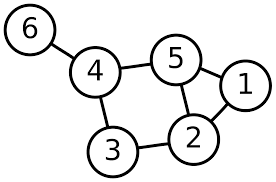

```{r setup, echo=FALSE, message=FALSE}
library(ggplot2)
library(sf)
```


### Question 1

4.6.2 from Banerjee, Carlin, Gelfand (2nd ed.) - Suppose $Y_1$ and $Y_2$ are both binary variables, and their joint distribution is defined through conditional logit models. That is,

$$ \log \frac{P(Y_1=1|Y_2)}{P(Y_1=0|Y_2)} = \alpha_0 + \alpha_1 \, Y_2 
\text{ and } 
\log \frac{P(Y_2=1|Y_1)}{P(Y_2=0|Y_1)} = \beta_0 + \beta_1 \, Y_1 $$

Obtain the joint distribution of $Y_1$ and $Y_2$. Describe any necessary constraints on the values of $\alpha_0$, $\alpha_1$, $\beta_0$, and $\beta_1$.


$$ ~ $$

-----

### Question 2



a. Derive a weight matrix using the network diagram above. Connected nodes should be indicated with a `1` all other entries should be 0.


$$
W = \begin{pmatrix}\end{pmatrix}
$$

b. Given that $\boldsymbol\sigma^2 = (\sigma_1^2, \sigma_2^2,\ldots,\sigma_6^2)$ and $\boldsymbol\epsilon \sim \mathcal{N}(\boldsymbol{0},\, \boldsymbol{I}\,\boldsymbol\sigma^2)$ derive the values of $\boldsymbol\Sigma$ and $\boldsymbol\Sigma^{-1}$ for a CAR model.

$$ \boldsymbol\Sigma^{-1} = \begin{pmatrix}\end{pmatrix}$$

c. Repeat b. using an SAR model.

$$ \boldsymbol\Sigma^{-1} = \begin{pmatrix}\end{pmatrix}$$

-----

### Question 3

The data folder in this repository contains two shapefiles describing congressional district boundaries for the 112th (2011-2013) and 114th (2015-2017) congress.

```{r}
nc112 = st_read('data/nc_districts112.shp', quiet=TRUE, stringsAsFactors=TRUE)
nc114 = st_read('data/nc_districts114.shp', quiet=TRUE, stringsAsFactors=TRUE)
```


a. A simplistic metric of distrinct compactness is the isoperimetric quotient, which is defined as the ratio of a shape's area to the area of a circle that has the same perimeter. Calculate and report this metric for all districts in both data sets. Also assesses if average compactness has changed between the 112th and 114th congress and if so in what direction?

```{r}

```

b. Using NC county boundaries, generate a data set containing the congression boundaries of only Durham, Orange and Wake Counties. Plot these boundaries.

```{r}

```

c. Create a map showing which regions of NC had their congressional district change between the 112th and 114th congress.

```{r}

```


-----

### Question 4

The data directory also contains data on Medicaid program quality scores for the lower 48 U.S. contiguous states in 1986. The data can be loaded as follows.

```{r}
mc = st_read('data/medicaid1986.shp', quiet=TRUE, stringsAsFactors=TRUE)
```

a. Construct a weight matrix using adjacency as determined by intersecting boundaries between the states (i.e. touching).

```{r}

```

b. Using this weight matrix calculate Moran's I or Geary's C using the `PQS` column in the data. Do your results suggest autocorrelation? If so what kind?

```{r}

```

c. Fit a CAR model for `PQS` using the weight matrix from a. Does your fitted value of $\phi$ agree with your conclusion in b.?

```{r}

```

d. Calculate residuals for each state, comment on where the model fits well and where it does not. Does it appear that there still may be unaccounted for spatial structure?

```{r}

```

-----

### Question 5

In this question you will repeat the analysis in Question 4 after aggregating the medicaid data to a regional level. You will have to merge the geometries using their `SUB_REGION` value (e.g. California, Oregon, and Washington should be a single unioned multipolygon for the Pacific region) as well as aggregate `PQS` values (using the mean of the included states).

a. Create an updated sf objected containing the joined regional data.

```{r}

```

b. Use a cholopleth plot to display the regional values of `PQS`.

```{r}

```

c. Construct a weight matrix using adjacency as determined by intersecting boundaries between the regions (i.e. touching).

```{r}

```

d. Using this weight matrix calculate Moran's I or Geary's C using the `PQS` column in the data. Do your results suggest autocorrelation? If so what kind?

```{r}

```

e. Fit a CAR model for `PQS` using the weight matrix from a. Does your fitted value of $\phi$ agree with your conclusion in b.?

```{r}

```

f. Calculate residuals for each region and comment on where the model fits well and where it does not. Does it appear that there still may be unaccounted for spatial structure?

```{r}

```